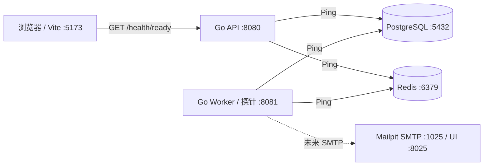

# Day02 架构设计：可运行骨架

Issue：`[PW-002] 跑通 Web、API、Worker 与开发依赖`  
分支：`feat/PW-002-runtime-skeleton`

本文将实施计划中的 Day02 转换为本仓库可直接执行的运行时契约。计划中的命令和 TODO 代码块属于项目材料，不应被脱离上下文盲目执行。

## Issue 定义

### 背景

当前仓库只有 Monorepo 约定和产品边界。本 Issue 在引入业务契约和持久化迁移之前，先建立可重复运行的基础环境。

### 范围清单

- [ ] 初始化独立的 Go API 和 Worker 入口。
- [ ] 加载统一配置并输出结构化 JSON 日志。
- [ ] 在平台边界之后创建 PostgreSQL 和 Redis 客户端。
- [ ] 实现 API 和 Worker 的存活/就绪探针。
- [ ] 实现 SIGINT/SIGTERM 优雅停机。
- [ ] 增加 PostgreSQL、Redis、Mailpit 开发 Compose。
- [ ] 初始化 React/Vite 健康状态页面和统一请求客户端。
- [ ] 验证 Go 测试、竞态测试和 Web 生产构建。

### 明确不在范围内

业务表和迁移、OpenAPI 业务路由、认证/JWT、监控 CRUD、Asynq Consumer、邮件发送、Tailwind/shadcn 视觉实现以及生产部署，均推迟到后续 Issue。

### 数据流

`Browser → API /health/ready → 并行 Ping PostgreSQL/Redis → 依赖状态 JSON → Browser`。

## 目标与边界

Day02 要让 Web、API、Worker、PostgreSQL、Redis、Mailpit 都能启动并可观测。今天不添加业务表、OpenAPI 业务路由、认证、监控 CRUD、Asynq Consumer 或 Tailwind/shadcn 视觉实现。

开发时使用 Docker Compose 运行依赖，Web/API/Worker 在 WSL 本机运行。后续发布可以增加完整应用 Compose，但不能改变这里确定的进程边界。

## 运行时架构



代码位于一个 Monorepo 中，但运行时仍保持三个程序：

- Web 负责 SPA、请求客户端和健康状态展示。
- API 负责 HTTP，以及未来的认证/业务 Handler 和事件转发。
- Worker 负责未来的调度、检测、状态转换、通知和清理。
- PostgreSQL 将作为业务状态的事实来源。
- Redis 是可恢复的运输/变化提示层，不是事实来源。
- Mailpit 是未来通知功能使用的本地 SMTP 接收端，不属于 Day02 的就绪依赖。

```text
pulsewatch/
├── api/                         # Day03 OpenAPI 源文件
├── server/
│   ├── cmd/api/main.go
│   ├── cmd/worker/main.go
│   ├── internal/health/
│   └── internal/platform/{config,database,queue,httpx,logging}
├── web/src/{app,features/health,shared/api}
├── deploy/compose.dev.yml
└── docs/day02-architecture.md
```

每个 `cmd` 包都是一个组合根。依赖方向如下：

```text
cmd/api, cmd/worker
        ↓
health 与未来的 service
        ↓
platform/database、platform/queue
        ↓
pgxpool、go-redis
```

Handler 不读取环境变量，也不直接写 SQL。平台包不读取 Cookie 或 HTTP 请求状态。

## 端口与配置

| 组件 | 绑定地址 | 用途 |
|---|---|---|
| Vite Web | `localhost:5173` | 浏览器界面 |
| API | `:8080` | 面向浏览器的 HTTP 服务 |
| Worker 探针 | `127.0.0.1:8081` | 本地进程健康检查 |
| PostgreSQL | `127.0.0.1:5432` | 开发数据库 |
| Redis | `127.0.0.1:6379` | 开发运输层 |
| Mailpit SMTP | `127.0.0.1:1025` | 未来邮件接收端 |
| Mailpit UI | `127.0.0.1:8025` | 本地邮箱查看 |

根目录 `.env.example` 包含 Day02 使用的变量：

- `APP_ENV` 默认值为 `development`。
- `HTTP_ADDR` 默认值为 `:8080`。
- `WORKER_HTTP_ADDR` 默认值为 `127.0.0.1:8081`。
- `DATABASE_URL` 和 `REDIS_ADDR` 必须提供。
- `REDIS_PASSWORD` 可选。
- `CORS_ALLOWED_ORIGINS` 默认值为 `http://localhost:5173`。
- `HEALTH_TIMEOUT` 默认值为 `2s`。
- `SHUTDOWN_TIMEOUT` 默认值为 `10s`。

JWT 和 SMTP 变量会提前保留在示例文件中，但 Day02 不校验它们。必填配置无效时，进程只显示变量名和抽象原因并启动失败，绝不打印变量值。

## 健康检查契约

API 路由：

```text
GET /health/live
GET /health/ready
```

Worker 路由相同，但只能通过 `127.0.0.1:8081` 访问。

就绪响应示例：

```json
{
  "status": "ready",
  "service": "api",
  "timestamp": "2026-09-12T10:00:00Z",
  "request_id": "health-test-1",
  "dependencies": {
    "postgres": { "status": "up", "latency_ms": 3 },
    "redis": { "status": "up", "latency_ms": 1 }
  }
}
```

规则：

- 进程能够响应时，`live` 返回 200，且不 Ping 依赖。
- `ready` 在 2 秒请求超时内并行 Ping PostgreSQL 和 Redis。
- 所有依赖正常时返回 200，且 `status: ready`。
- 任一依赖失败时返回 503，且 `status: not_ready`。
- 失败依赖只暴露稳定的 `error_code`，例如 `unavailable` 或 `timeout`。
- 原始驱动错误、URL、用户名和密码不会进入 JSON。
- 每个响应都包含 `Cache-Control: no-store` 和 `X-Request-ID`。
- 如果传入安全的 `X-Request-ID` 就沿用；缺失或不安全时生成新的 ID。
- 停机时先将 readiness 设为 not-ready，再排空请求。

浏览器请求使用 `credentials: include`，健康请求失败时重试一次，并每 5 秒刷新一次查询。页面只展示“API 就绪”或“API 不可用”，同时显示依赖状态和用于排障的 `request_id`。

## 生命周期与优雅停机

API 启动时加载配置，创建 PostgreSQL pool 和 Redis client，组装中间件与路由，最后启动 HTTP server。依赖暂时不可用不会导致进程崩溃；依赖恢复前 readiness 持续返回 503。

收到 SIGINT/SIGTERM 后：

1. 将 readiness 标记为 not-ready。
2. 停止接受新的 API 请求。
3. 最多等待 10 秒排空正在处理的 HTTP 请求。
4. 关闭 Redis 和 PostgreSQL 客户端。
5. 记录结构化停止事件；只有超时后才强制关闭。

Worker 遵循相同顺序，并在关闭客户端前停止 30 秒 heartbeat 和探针。Day02 不消费任务。

HTTP server 使用 5 秒 Header 超时、15 秒请求超时、60 秒空闲超时和有限的 Header 大小。`WriteTimeout` 保持未设置，因为 Day11 的 SSE 响应会长期保持连接。

## CORS 与日志

开发环境只允许 `http://localhost:5173`，启用 credentials，并允许标准 HTTP 方法以及 `Authorization`、`Content-Type`、`X-Request-ID` 请求头。未知 Origin 返回 403，禁止使用通配符 Origin。

结构化日志包含 `service`、`environment`、`request_id`、method、path、status 和 latency。日志绝不包含数据库 URL、密码、JWT、Cookie、Authorization 请求头或 refresh token。Panic 响应使用通用错误内容。

## 开发命令

```bash
docker compose -f deploy/compose.dev.yml up -d
docker compose -f deploy/compose.dev.yml ps

cd server && go run ./cmd/api
# 另一个终端：cd server && go run ./cmd/worker
# 另一个终端：cd web && npm install && npm run dev
```

依赖 Compose 文件只包含 PostgreSQL 16、Redis 7 和固定版本的 Mailpit v1 镜像。每个服务都有 healthcheck 和命名卷，端口只绑定本机回环地址。

## 故障演练与验收

```bash
curl -i http://localhost:8080/health/live
curl -i http://localhost:8080/health/ready
curl -i http://127.0.0.1:8081/health/live
curl -i http://127.0.0.1:8081/health/ready

docker compose -f deploy/compose.dev.yml stop postgres
curl -i http://localhost:8080/health/ready  # 503，postgres 不可用
docker compose -f deploy/compose.dev.yml start postgres

docker compose -f deploy/compose.dev.yml stop redis
curl -i http://localhost:8080/health/ready  # 503，redis 不可用
docker compose -f deploy/compose.dev.yml start redis
```

验收证据包括 Compose 状态、live/ready 响应、两种依赖故障响应、Web 状态截图、停机日志、Go 测试结果和成功的 Web 生产构建。

自动化覆盖包括配置校验、错误信息脱敏、并行依赖检查、超时/错误分类、request ID、CORS、live/ready 状态码、draining 行为和 Worker heartbeat 生命周期。

## 后续兼容性

- Day03 增加 `api/openapi.yaml`、迁移、sqlc 和生成类型，不改变进程或平台边界。
- Day04/05 通过现有 CORS/credentials 设置增加认证和浏览器会话。
- Day08 在现有 Redis 平台客户端之上接入 Asynq；PostgreSQL 继续以 `run_id` 和状态为权威。
- Day11 增加 Redis Pub/Sub、认证 SSE 和 Nginx 代理；API server 有意不设置长连接 WriteTimeout。
- Day14 可以增加完整应用 Compose 和独立镜像，但不会把 API 和 Worker 合并为一个运行时。
